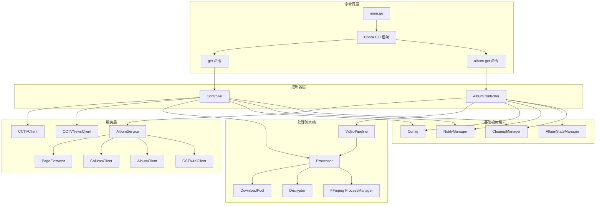
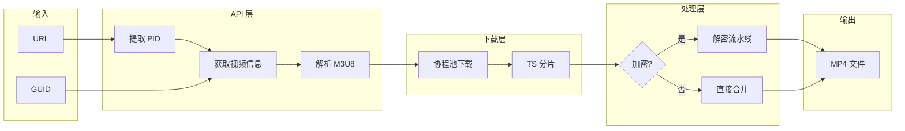
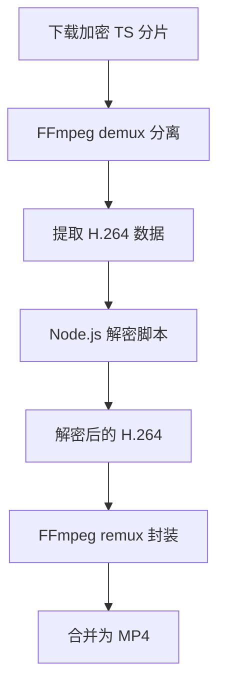

# CCTVDownloadGo

基于 Go 语言的高性能 CCTV 视频下载 CLI 工具，支持加密流解密和普通流直接下载。

## 项目简介

CCTVDownloadGo 是一个命令行工具，用于从央视网（CCTV）下载视频内容。该工具支持单视频下载和专辑批量下载，能够自动处理加密的 HLS 流，并提供断点续传功能。

## 功能特性

- **单视频下载**：通过 URL 或 GUID 下载单个视频
- **专辑批量下载**：批量下载整个专辑的所有视频
- **加密流解密**：自动识别并解密加密的 HLS 流
- **4K 视频支持**：支持下载 CCTV 4K 频道视频
- **断点续传**：专辑下载支持状态持久化，中断后可继续
- **并发下载**：多协程并发下载，提高效率
- **进度显示**：实时显示下载和处理进度
- **跨平台**：支持 Windows、Linux、macOS

## 项目架构

### 目录结构

```
CCTVDownloadGo/
├── cmd/cctvdown/              # 命令行入口
│   ├── main.go               # 主入口，CLI 初始化
│   ├── controller.go         # 单视频下载控制器
│   └── album_cmd.go          # 专辑下载控制器
├── internal/                  # 内部模块（不对外暴露）
│   ├── api/                  # API 客户端层
│   │   ├── cctv.go          # CCTV 视频 API
│   │   ├── cctvnews.go      # CCTV 新闻 API
│   │   ├── cctv4k.go        # 4K 频道 API
│   │   ├── album_service.go # 专辑服务（整合多种 API）
│   │   ├── column.go        # 栏目 API
│   │   ├── album.go         # 专辑 API
│   │   ├── page_info.go     # 页面信息提取
│   │   ├── hls_parser.go    # M3U8 播放列表解析
│   │   ├── pid_extractor.go # PID 提取器
│   │   └── signature.go     # 请求签名
│   ├── config/               # 配置管理
│   │   └── config.go        # 配置加载与默认值
│   ├── downloader/           # 下载器模块
│   │   ├── pool.go          # 下载协程池
│   │   └── m3u8.go          # M3U8 处理
│   ├── processor/            # 视频处理模块
│   │   ├── decryptor.go     # Node.js 解密器
│   │   ├── pipeline.go      # 处理流水线
│   │   ├── nal_parser.go    # NAL 单元解析
│   │   └── ordered_buffer.go # 有序缓冲区
│   ├── pipeline/             # 视频任务流水线
│   │   └── video_pipeline.go # 专辑视频处理流水线
│   ├── ffmpeg/               # FFmpeg 封装
│   │   ├── command.go       # 命令构建
│   │   └── process.go       # 进程管理
│   ├── state/                # 状态管理
│   │   └── album_state.go   # 专辑下载状态持久化
│   ├── notify/               # 通知管理
│   │   ├── notify.go       # 控制台通知
│   │   └── logger.go        # 日志系统
│   ├── title/                 # 标题处理
│   │   └── title.go         # 文件名安全化
│   └── utils/                 # 工具函数
│       ├── cleanup.go       # 临时文件清理
│       ├── dependency.go    # 依赖检查
│       └── string.go        # 字符串工具
├── assets/decrypt/            # 解密脚本
│   ├── dec.mjs              # Node.js 解密脚本
│   └── cctv.worker.new.js   # 解密 Worker
├── docs/                      # 文档目录
├── build.bat                  # Windows 构建脚本
├── go.mod                     # Go 模块定义
└── go.sum                     # 依赖校验
```

### 架构图



### 数据流程图



## 技术栈

| 类别 | 技术 |
|------|------|
| 语言 | Go 1.26.0 |
| CLI 框架 | github.com/spf13/cobra |
| 配置管理 | github.com/spf13/viper |
| HTTP 客户端 | github.com/go-resty/resty |
| 并发控制 | golang.org/x/sync |
| 视频处理 | FFmpeg |
| 解密引擎 | Node.js |

## 安装

### 前置要求

- Go 1.26.0 或更高版本
- FFmpeg（已添加到系统 PATH 或通过配置指定）
- Node.js（用于加密流解密）

### 从源码构建

```bash
# 克隆仓库
git clone https://github.com/CCTVDownloadGo/cctvdown.git
cd cctvdown

# 构建（Windows）
build.bat

# 或手动构建
go build -o dist/cctvdown.exe ./cmd/cctvdown/
```

### 配置文件

首次运行时会自动生成默认配置文件 `cctvdown.yaml`：

```yaml
# 日志配置
log_level: info
log_file: ./logs/app.log

# 下载设置
download_workers: 8
ffmpeg_concurrency: 8
output_dir: ./videos
temp_dir: $TEMP/cctvdown

# 专辑流水线配置
album_download_slots: 2
album_process_workers: 2
decrypt_workers: 8

# 工具路径
ffmpeg_path: ffmpeg
node_path: node

# 网络设置
timeout: 30s
max_retries: 3
```

## 使用方法

### 基本命令

```bash
# 查看帮助
cctvdown --help

# 查看版本
cctvdown --version
```

### 单视频下载

```bash
# 通过 URL 下载
cctvdown get -u https://tv.cctv.com/2024/01/02/VIDEPCQnfxh5ihmlidn0rbfR240102.shtml

# 通过 GUID 下载
cctvdown get -g <32位十六进制GUID>

# 指定输出目录
cctvdown get -u <URL> --output ./my_videos

# 详细输出
cctvdown get -u <URL> -v
```

### 专辑批量下载

```bash
# 下载整个专辑
cctvdown album get -u <专辑URL>

# 指定日期范围（yyyyMM 格式）
cctvdown album get -u <专辑URL> --start 202401 --end 202412

# 跳过确认直接下载
cctvdown album get -u <专辑URL> --yes

# 强制重新开始（忽略已有状态）
cctvdown album get -u <专辑URL> --restart
```

### 全局参数

| 参数 | 简写 | 说明 |
|------|------|------|
| `--output` | `-o` | 输出目录 |
| `--ffmpeg` | | FFmpeg 可执行路径 |
| `--node` | | Node.js 可执行路径 |
| `--workers` | | 下载并发数 |
| `--ffmpeg-concurrency` | | FFmpeg 最大并发数 |
| `--log-level` | | 日志级别（debug/info/warn/error） |
| `--log-file` | | 日志文件路径 |
| `--verbose` | `-v` | 详细输出 |
| `--quiet` | `-q` | 静默模式 |

## 核心模块说明

### API 模块

API 模块负责与央视网后端 API 交互：

- **CCTVClient**：获取视频信息、解析 M3U8 播放列表
- **CCTVNewsClient**：处理新闻类视频
- **CCTV4KClient**：处理 4K 频道视频
- **AlbumService**：整合多种 API，统一获取专辑视频列表
- **PageExtractor**：从网页提取视频元信息

### 下载器模块

下载器模块实现高效的并发下载：

- **DownloadPool**：协程池管理，支持重试和进度回调
- **M3U8 Parser**：解析 M3U8 播放列表，提取 TS 分片 URL

### 处理器模块

处理器模块实现视频后处理：

- **Decryptor**：调用 Node.js 脚本解密加密的 H.264 数据
- **Pipeline**：5 阶段流水线处理（demux → 解密 → remux → 有序合并 → 最终合并）
- **OrderedBuffer**：确保分片按顺序合并

### 状态管理模块

状态管理模块实现断点续传：

- 持久化下载状态到 JSON 文件
- 记录已完成/失败的视频 GUID
- 支持恢复中断的下载任务

## 加密流处理流程

CCTV 部分视频采用加密的 HLS 流，处理流程如下：



1. **下载**：并发下载所有加密的 TS 分片
2. **解复用**：使用 FFmpeg 从 TS 中提取 H.264 视频和 AAC 音频
3. **解密**：调用 Node.js 脚本解密 H.264 数据
4. **重封装**：将解密后的 H.264 重新封装为 MP4 容器
5. **合并**：按顺序合并所有分片为最终视频文件

## 开发指南

### 添加新的 API 支持

1. 在 `internal/api/` 下创建新的客户端文件
2. 实现 API 调用和响应解析
3. 在 `AlbumService` 中集成新客户端

### 扩展处理器

1. 在 `internal/processor/` 下添加新的处理逻辑
2. 实现 `Decryptor` 接口（如需要）
3. 在 `Pipeline` 中集成新处理阶段

### 代码规范

- 遵循 Go 标准代码规范
- 使用 `slog` 进行日志记录
- 错误处理使用 `fmt.Errorf` 包装
- 导出函数需添加注释

## 许可证

本项目采用 MIT 许可证，详见 [LICENSE](LICENSE) 文件。

## 免责声明

本项目仅供学习和研究使用，请勿用于商业用途。使用本工具下载的视频内容版权归原作者所有，请遵守相关法律法规。

## 贡献

欢迎提交 Issue 和 Pull Request！

1. Fork 本仓库
2. 创建特性分支：`git checkout -b feature/my-feature`
3. 提交更改：`git commit -am 'Add some feature'`
4. 推送分支：`git push origin feature/my-feature`
5. 提交 Pull Request
