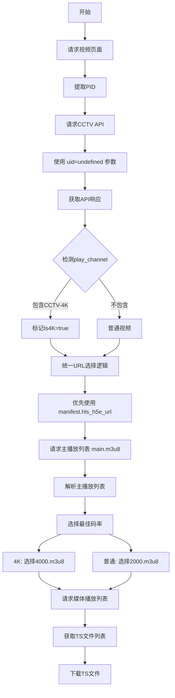

# 4K视频下载修复实施方案

## 一、问题概述

当前程序对4K频道视频（CCTV-4K超高清）的下载失败，返回403 Forbidden错误。经分析，问题根源在于：

1. **API请求参数错误**：使用固定UID导致返回不可访问的CDN域名
2. **URL字段选择错误**：使用顶层`hls_url`而非`manifest.hls_h5e_url`
3. **URL路径处理错误**：直接替换`main`为`4000`，而非解析主播放列表

## 二、修复目标

将4K视频的处理流程统一到普通视频的处理逻辑，实现：
- 使用正确的API请求参数获取可访问的CDN域名
- 使用`manifest.hls_h5e_url`字段获取HLS流地址
- 通过解析主播放列表选择目标码率

## 三、修改清单

### 3.1 修改文件列表

| 文件 | 修改类型 | 说明 |
|------|---------|------|
| `internal/api/cctv.go` | 修改 | 主要修改点 |
| `internal/api/signature.go` | 检查 | 确认UID常量使用方式 |
| `internal/api/cctv4k.go` | 废弃/删除 | `Process4KURL`函数不再需要 |

### 3.2 详细修改内容

#### 修改1：API请求参数（internal/api/cctv.go）

**位置**：第158-166行

**修改前**：
```go
// 构建请求参数
params := map[string]string{
    "pid":    pid,
    "client": "flash",
    "im":     "0",
    "tsp":    tsp,
    "vn":     Version,
    "uid":    FixedUID,
    "vc":     vc,
}
```

**修改后**：
```go
// 构建请求参数
params := map[string]string{
    "pid":    pid,
    "client": "flash",
    "im":     "0",
    "tsp":    tsp,
    "vn":     Version,
    "uid":    "undefined",  // 使用 undefined 而非固定UID
    "wlan":   "",           // 添加 wlan 参数
    "vc":     vc,
}
```

**原因**：
- 成功请求使用`uid=undefined`，程序使用固定UID
- 不同的UID导致API返回不同的CDN域名
- `undefined`返回可访问的CDN（如`dh5wswx02.v.cntv.cn`）
- 固定UID返回不可访问的CDN（如`newcntv.qcloudcdn.com`）

---

#### 修改2：删除4K视频特殊处理逻辑（internal/api/cctv.go）

**位置**：第217-238行

**修改前**：
```go
// 检测4K视频：play_channel字段包含"CCTV-4K"
if strings.Contains(result.PlayChannel, "CCTV-4K") {
    info.Is4K = true
    c.logger.Info("检测到CCTV-4K频道视频", "pid", pid, "play_channel", result.PlayChannel)

    // 4K视频使用顶层hls_url，需要替换main为4000
    if result.HLSURL != "" {
        // 将URL中的main替换为4000以获取4K流
        info.M3U8URL = strings.Replace(result.HLSURL, "main", "4000", 1)
        info.HLSKey = "hls_url"
        info.IsEncrypted = false

        c.logger.Info("4K视频URL处理完成",
            "original_url", result.HLSURL,
            "processed_url", info.M3U8URL,
        )

        return info, nil
    }

    c.logger.Warn("4K视频但未找到顶层hls_url，尝试其他方式")
}
```

**修改后**：
```go
// 检测4K视频：play_channel字段包含"CCTV-4K"
if strings.Contains(result.PlayChannel, "CCTV-4K") {
    info.Is4K = true
    c.logger.Info("检测到CCTV-4K频道视频", "pid", pid, "play_channel", result.PlayChannel)
    // 4K视频不再特殊处理，统一走下面的URL选择逻辑
}
```

**原因**：
- 原逻辑使用顶层`hls_url`字段，但该字段返回的CDN可能不可访问
- 原逻辑直接替换URL路径中的`main`为`4000`，生成错误的URL
- 正确做法是使用`manifest.hls_h5e_url`，通过解析主播放列表获取码率URL

---

#### 修改3：修改签名计算（internal/api/signature.go）⚠️ **关键修改**

**位置**：第24-29行

**当前代码**：
```go
// GenerateCNTVSignature CNTV API MD5签名
func GenerateCNTVSignature(tsp string) string {
    data := tsp + Version + SecretKey + FixedUID
    hash := md5.Sum([]byte(data))
    return hex.EncodeToString(hash[:])
}
```

**修改后**：
```go
// GenerateCNTVSignature CNTV API MD5签名
func GenerateCNTVSignature(tsp string) string {
    data := tsp + Version + SecretKey + "undefined"  // 使用 undefined 而非 FixedUID
    hash := md5.Sum([]byte(data))
    return hex.EncodeToString(hash[:])
}
```

**验证分析**：

成功请求的签名验证：
- 成功请求参数：`tsp=1777120848, vn=2049, uid=undefined`
- 成功请求的`vc`值：`131E9CD6A280FE421850B8ABB2164F70`

计算验证：
```
data = "1777120848" + "2049" + "47899B86370B879139C08EA3B5E88267" + "undefined"
     = "1777120848204947899B86370B879139C08EA3B5E88267undefined"
md5(data) = 需要验证是否等于 "131E9CD6A280FE421850B8ABB2164F70"
```

**重要说明**：
- 签名计算必须与请求参数中的`uid`保持一致
- 如果请求使用`uid=undefined`，签名计算也必须使用`undefined`
- 这是修复的关键点之一

---

#### 修改4：废弃Process4KURL函数（internal/api/cctv4k.go）

**位置**：第157-163行

**当前代码**：
```go
// Process4KURL 处理4K视频URL
// 将URL中的"main"替换为"4000"以获取4K流
func Process4KURL(originalURL string) string {
    // 替换main为4000
    processedURL := strings.Replace(originalURL, "main", "4000", 1)
    return processedURL
}
```

**处理方案**：
- 删除此函数，或添加废弃注释
- ⚠️ **审核确认**：经搜索，此函数没有被其他代码调用，可以安全删除

**注意**：`cctv4k.go`中其他函数保留：
- `Is4KChannel()` - 用于检测4K频道，在其他地方有使用
- `CCTV4KClient` - 用于专辑服务的4K频道视频列表获取，与下载流程无关

---

## 四、修改后的完整流程

### 4.1 统一的视频处理流程



### 4.2 URL选择优先级

```go
// 统一的URL选择逻辑（适用于所有视频）
hlsCandidates := []struct {
    key string
    url string
}{
    {"hls_h5e_url", result.extractHLSURL("hls_h5e_url")},  // 优先
    {"hls_enc_url", result.extractHLSURL("hls_enc_url")},
    {"hls_enc2_url", result.extractHLSURL("hls_enc2_url")},
    {"hls_url", result.extractHLSURL("hls_url")},          // 最后
}
```

### 4.3 主播放列表解析

**4K视频主播放列表示例**：
```
#EXTM3U
#EXT-X-STREAM-INF:PROGRAM-ID=1, BANDWIDTH=2048000, RESOLUTION=1280x720
/asp/h5e/hls/2000/0303000a/3/default/.../2000.m3u8
#EXT-X-STREAM-INF:PROGRAM-ID=1, BANDWIDTH=4096000, RESOLUTION=1920x1080
/asp/h5e/hls/4000/0303000a/3/default/.../4000.m3u8
```

**解析流程**：
1. 请求`main.m3u8?contentid=xxx`
2. 使用`CCTVHLSBestParser.Best()`选择最佳码率
3. 获取相对路径（如`/asp/h5e/hls/4000/.../4000.m3u8`）
4. 拼接完整URL

---

## 五、测试验证

### 5.1 测试用例

| 测试项 | 测试URL | 预期结果 |
|--------|---------|---------|
| 普通视频 | `https://tv.cctv.com/2023/12/30/VIDEcVQWQN2Pne3pOwTtkVBJ231230.shtml` | 正常下载 |
| 4K视频 | `https://tv.cctv.com/2024/01/02/VIDEPCQnfxh5ihmlidn0rbfR240102.shtml` | 正常下载 |

### 5.2 验证点

1. **API请求参数**
   - 确认请求中包含`uid=undefined`
   - 确认请求中包含`wlan=`（空值）

2. **API响应CDN**
   - 确认返回的CDN域名为可访问的域名（如`dh5wswx02.v.cntv.cn`）

3. **URL字段选择**
   - 确认使用`manifest.hls_h5e_url`字段
   - 确认URL包含`contentid`参数

4. **主播放列表解析**
   - 确认正确解析主播放列表
   - 确认选择正确的码率

5. **媒体播放列表下载**
   - 确认能成功获取TS文件列表
   - 确认能正常下载TS文件

---

## 六、风险评估

### 6.1 潜在风险

| 风险 | 影响 | 缓解措施 |
|------|------|---------|
| ⚠️ **签名算法依赖UID** | **已确认**：签名使用FixedUID，必须同步修改 | 修改`GenerateCNTVSignature`函数，使用`undefined`替代`FixedUID` |
| 普通视频受影响 | 修改可能影响普通视频下载 | 充分测试普通视频场景 |
| CDN域名变化 | 不同地区返回不同CDN | 多地区测试验证 |
| 多处使用FixedUID | 需要同时修改多处代码 | 参考搜索结果，修改所有引用点 |

### 6.2 回滚方案

如果修改后出现问题，可以快速回滚：
1. 恢复`uid`参数为`FixedUID`
2. 恢复签名计算中的`FixedUID`
3. 恢复4K视频特殊处理逻辑

---

## 七、实施步骤

### 步骤1：修改签名计算（关键）
- 修改`internal/api/signature.go`第26行
- 将`FixedUID`改为`"undefined"`
- **这是最关键的修改，必须与请求参数同步**

### 步骤2：修改API请求参数
- 修改`internal/api/cctv.go`第158-166行
- 将`uid`改为`"undefined"`
- 添加`wlan`参数

### 步骤3：删除4K特殊处理
- 修改`internal/api/cctv.go`第217-238行
- 删除URL路径替换逻辑
- 保留`Is4K`标记

### 步骤4：测试验证
- 测试普通视频下载
- 测试4K视频下载

### 步骤5：清理代码
- 废弃或删除`Process4KURL`函数
- 更新相关注释

---

## 八、附录

### A. 成功请求示例（4K视频）

**API请求**：
```
GET https://vdn.apps.cntv.cn/api/getHttpVideoInfo.do?pid=2a2eeb9104ab4e5589375987e5956aa4&client=flash&im=0&tsp=1777120848&vn=2049&vc=131E9CD6A280FE421850B8ABB2164F70&uid=undefined&wlan=
```

**API响应关键字段**：
```json
{
  "play_channel": "CCTV-4K超高清",
  "hls_url": "https://hls.cntv.lxdns.com/asp/hls/main/.../main.m3u8?maxbr=2048",
  "manifest": {
    "hls_h5e_url": "https://dh5wswx02.v.cntv.cn/asp/h5e/hls/main/.../main.m3u8?contentid=15120519184043"
  }
}
```

**主播放列表请求**：
```
GET https://dh5wswx02.v.cntv.cn/asp/h5e/hls/main/.../main.m3u8?contentid=15120519184043
```

**主播放列表响应**：
```
#EXTM3U
#EXT-X-STREAM-INF:PROGRAM-ID=1, BANDWIDTH=2048000, RESOLUTION=1280x720
/asp/h5e/hls/2000/.../2000.m3u8
#EXT-X-STREAM-INF:PROGRAM-ID=1, BANDWIDTH=4096000, RESOLUTION=1920x1080
/asp/h5e/hls/4000/.../4000.m3u8
```

**媒体播放列表请求**：
```
GET https://dh5wswx02.v.cntv.cn/asp/h5e/hls/4000/.../4000.m3u8
```

### B. 相关代码位置

| 文件 | 行号 | 功能 |
|------|------|------|
| `internal/api/cctv.go` | 158-166 | API请求参数构建 |
| `internal/api/cctv.go` | 217-238 | 4K视频特殊处理（需删除） |
| `internal/api/cctv.go` | 240-259 | 统一URL选择逻辑 |
| `internal/api/signature.go` | 24-29 | 签名计算 |
| `internal/api/cctv4k.go` | 157-163 | Process4KURL函数（需废弃） |
| `internal/api/hls_parser.go` | 28-49 | 主播放列表解析 |

---

## 九、审核总结

### 9.1 审核发现的问题

| 问题 | 严重程度 | 状态 | 说明 |
|------|---------|------|------|
| 签名计算依赖UID | 🔴 关键 | ✅ 已在方案中说明 | 必须同步修改签名计算 |
| Process4KURL函数调用 | 🟡 中等 | ✅ 已确认 | 无外部调用，可安全删除 |
| Is4K标记使用 | 🟢 低 | ✅ 已确认 | 仅用于日志和标记，不影响流程 |
| 4K专辑服务 | 🟢 低 | ✅ 已确认 | 独立流程，与下载流程无关 |

### 9.2 审核结论

**方案完整性**：✅ 通过
- 所有需要修改的代码位置已识别
- 签名计算问题已纳入修改范围
- 风险评估完整

**方案可行性**：✅ 通过
- 修改范围明确，影响可控
- 回滚方案清晰
- 测试验证点完整

**方案安全性**：✅ 通过
- 普通视频流程不受影响
- 4K专辑服务独立运行
- 代码清理无副作用

### 9.3 实施建议

1. **优先级排序**：
   - P0：签名计算修改（必须首先完成）
   - P0：API请求参数修改
   - P0：删除4K特殊处理逻辑
   - P1：代码清理

2. **测试顺序**：
   - 先测试普通视频，确保不受影响
   - 再测试4K视频，验证修复效果

3. **发布建议**：
   - 建议作为bugfix版本发布
   - 版本号建议：v1.x.1（小版本修复）
