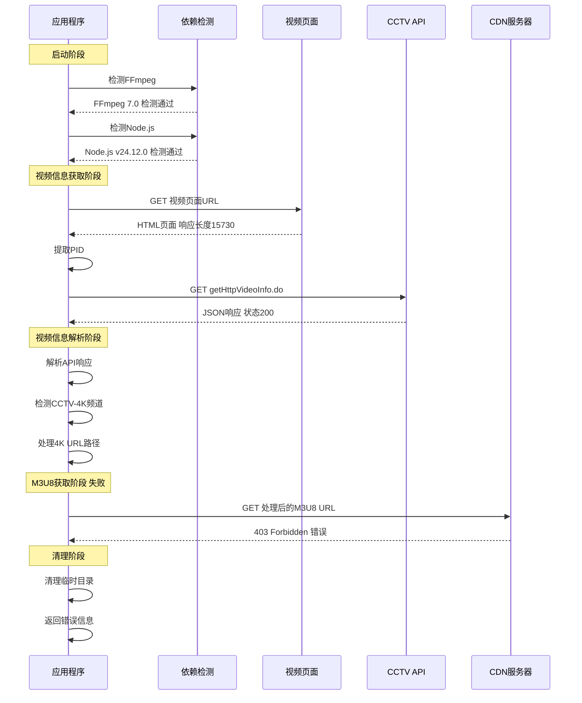
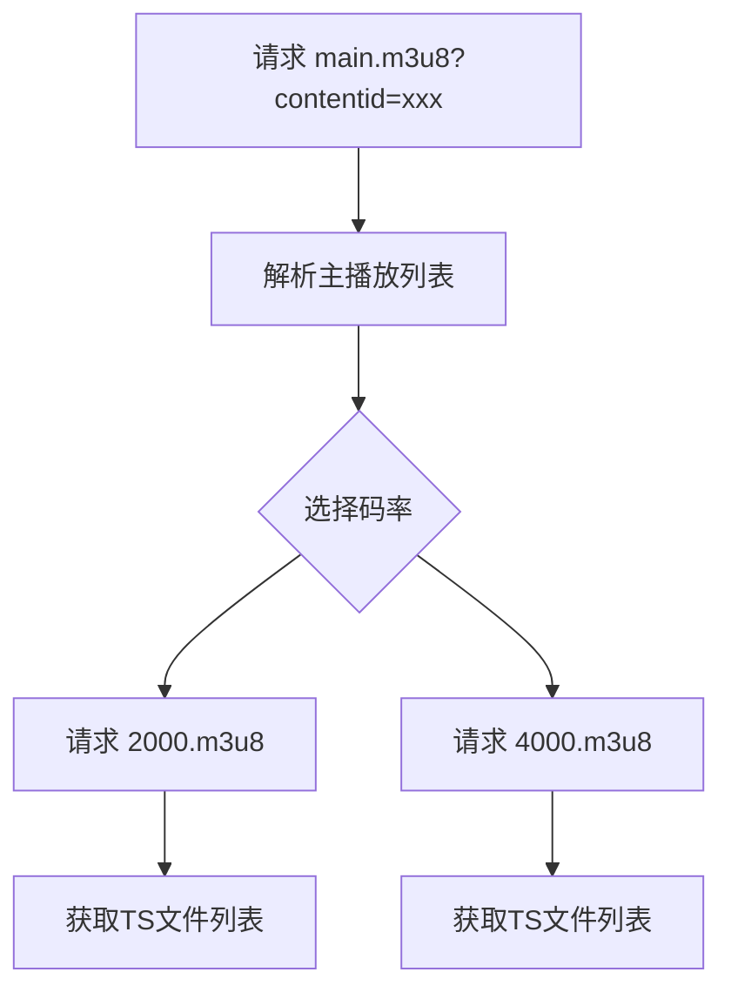
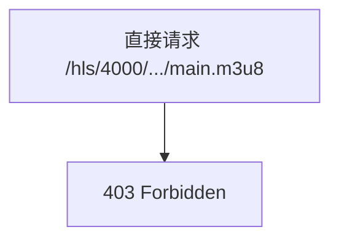
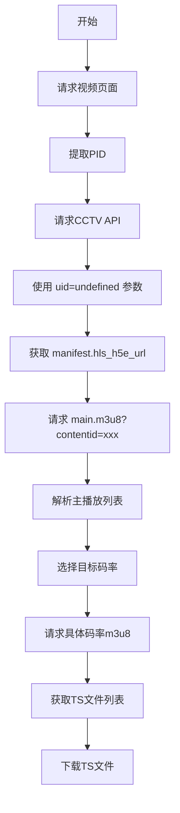

# CCTV下载器请求响应流程分析

## 概述

本文档基于 `logs/app.log` 日志文件和原始文件目录下的成功请求，对比分析请求失败的原因。

## 流程时序图



## 详细流程分析

### 阶段一：依赖检测

| 时间 | 操作 | 结果 |
|------|------|------|
| 20:28:48.089 | FFmpeg检测 | 通过 - 版本: 7.0-essentials_build-www.gyan.dev |
| 20:28:48.097 | Node.js检测 | 通过 - 版本: v24.12.0 |

### 阶段二：视频页面请求

| 时间 | 操作 | 详情 |
|------|------|------|
| 20:28:48.097 | 请求视频页面 | URL: `https://tv.cctv.com/2024/01/02/VIDEPCQnfxh5ihmlidn0rbfR240102.shtml` |
| 20:28:48.304 | 收到响应 | 响应长度: 15730 字节 |
| 20:28:48.304 | PID提取 | PID: `2a2eeb9104ab4e5589375987e5956aa4` |

### 阶段三：CCTV API请求

| 时间 | 操作 | 详情 |
|------|------|------|
| 20:28:48.305 | 构建API请求 | URL: `https://vdn.apps.cntv.cn/api/getHttpVideoInfo.do` |
| 20:28:48.622 | 收到API响应 | 状态码: 200 |

---

## 核心问题分析：成功请求 vs 失败请求对比

### 对比表格

| 对比项 | 成功请求（原始文件） | 失败请求（程序） | 问题 |
|--------|---------------------|-----------------|------|
| **API请求UID参数** | `uid=undefined` | `uid=826D8646DEBBFD97A82D23CAE45A55BE` | 程序使用固定UID |
| **API响应hls_url** | `hls.cntv.lxdns.com` | `newcntv.qcloudcdn.com` | CDN域名不同 |
| **API响应hls_h5e_url** | `dh5wswx02.v.cntv.cn` | `dh5.cntv.qcloudcdn.com` | CDN域名不同 |
| **使用的URL字段** | `manifest.hls_h5e_url` | `hls_url` | 字段选择错误 |
| **M3U8请求路径** | `/asp/h5e/hls/4000/.../4000.m3u8` | `/asp/hls/4000/.../main.m3u8` | 路径结构不同 |
| **contentid参数** | 包含 `contentid=15120519184043` | 无 | 缺少必要参数 |
| **请求流程** | 先请求main.m3u8，解析后请求4000.m3u8 | 直接请求修改后的URL | 流程错误 |

### 问题一：API请求参数差异

**成功请求参数：**
```
pid=2a2eeb9104ab4e5589375987e5956aa4
client=flash
im=0
tsp=1777120848
vn=2049
vc=131E9CD6A280FE421850B8ABB2164F70
uid=undefined
wlan=
```

**失败请求参数：**
```
pid=2a2eeb9104ab4e5589375987e5956aa4
client=flash
im=0
tsp=1777120128
vn=2049
vc=15e2cf52d164264fec026d9265466ac7
uid=826D8646DEBBFD97A82D23CAE45A55BE
```

**关键差异：**
- 成功请求使用 `uid=undefined`
- 失败请求使用固定UID `826D8646DEBBFD97A82D23CAE45A55BE`
- 成功请求包含 `wlan=` 参数（空值）

### 问题二：API响应CDN域名差异

**成功请求的API响应：**
```json
{
  "hls_url": "https://hls.cntv.lxdns.com/asp/hls/main/0303000a/3/default/.../main.m3u8?maxbr=2048",
  "manifest": {
    "hls_h5e_url": "https://dh5wswx02.v.cntv.cn/asp/h5e/hls/main/0303000a/3/default/.../main.m3u8?contentid=15120519184043"
  }
}
```

**失败请求的API响应：**
```json
{
  "hls_url": "https://newcntv.qcloudcdn.com/asp/hls/main/0303000a/3/default/.../main.m3u8?maxbr=2048",
  "manifest": {
    "hls_h5e_url": "https://dh5.cntv.qcloudcdn.com/asp/h5e/hls/main/0303000a/3/default/.../main.m3u8?contentid=15120519184043"
  }
}
```

**分析：**
- 不同的UID参数导致API返回不同的CDN域名
- `dh5wswx02.v.cntv.cn` 是可访问的CDN
- `newcntv.qcloudcdn.com` 和 `dh5.cntv.qcloudcdn.com` 可能对特定请求有限制

### 问题三：URL字段选择错误

**程序当前逻辑（错误）：**
```go
// 使用 hls_url 字段
hlsURL := result.HLSURL  // https://newcntv.qcloudcdn.com/asp/hls/main/...
```

**正确逻辑：**
```go
// 应使用 manifest.hls_h5e_url 字段
hlsURL := result.Manifest.HLSH5EURL  // https://dh5wswx02.v.cntv.cn/asp/h5e/hls/main/...
```

**原因：**
- `hls_url` 返回的是普通HLS流，CDN可能有限制
- `manifest.hls_h5e_url` 返回的是H5播放器专用流，访问限制较少

### 问题四：M3U8请求流程错误

**成功请求流程：**



**成功请求的main.m3u8响应：**
```
#EXTM3U
#EXT-X-STREAM-INF:PROGRAM-ID=1, BANDWIDTH=2048000, RESOLUTION=1280x720
/asp/h5e/hls/2000/0303000a/3/default/.../2000.m3u8
#EXT-X-STREAM-INF:PROGRAM-ID=1, BANDWIDTH=4096000, RESOLUTION=1920x1080
/asp/h5e/hls/4000/0303000a/3/default/.../4000.m3u8
```

**失败请求流程（错误）：**


**程序错误逻辑：**
```go
// 错误：直接将 main 替换为 4000
processedURL := strings.Replace(originalURL, "main", "4000", 1)
// 结果：/asp/hls/4000/.../main.m3u8 （错误路径）
```

**正确路径应该是：**
- 原始：`/asp/h5e/hls/main/.../main.m3u8?contentid=xxx`
- 正确的4000路径：`/asp/h5e/hls/4000/.../4000.m3u8`（从主播放列表解析获得）

### 问题五：缺少contentid参数

**成功请求：**
```
GET https://dh5wswx02.v.cntv.cn/asp/h5e/hls/main/.../main.m3u8?contentid=15120519184043
```

**失败请求：**
```
GET https://newcntv.qcloudcdn.com/asp/hls/4000/.../main.m3u8?maxbr=2048
```

**分析：**
- `contentid` 参数是访问H5E流的必要参数
- 程序请求缺少此参数，导致CDN拒绝访问

---

## 修复方案

### 方案概述



### 具体修改点

#### 1. 修改API请求参数

**文件：** [`internal/api/cctv.go`](internal/api/cctv.go)

```go
// 修改前
params := map[string]string{
    "pid":    pid,
    "client": "flash",
    "im":     "0",
    "tsp":    tsp,
    "vn":     Version,
    "uid":    FixedUID,  // 错误：使用固定UID
    "vc":     vc,
}

// 修改后
params := map[string]string{
    "pid":    pid,
    "client": "flash",
    "im":     "0",
    "tsp":    tsp,
    "vn":     Version,
    "uid":    "undefined",  // 使用 undefined
    "wlan":   "",           // 添加 wlan 参数
    "vc":     vc,
}
```

#### 2. 修改URL字段选择

**文件：** [`internal/api/cctv.go`](internal/api/cctv.go)

```go
// 修改前：使用 hls_url
hlsURL := result.HLSURL

// 修改后：优先使用 manifest.hls_h5e_url
hlsURL := result.Manifest.HLSH5EURL
if hlsURL == "" {
    hlsURL = result.HLSURL  // 降级方案
}
```

#### 3. 修改4K URL处理逻辑

**文件：** [`internal/api/cctv4k.go`](internal/api/cctv4k.go)

```go
// 修改前：直接替换路径
func Process4KURL(originalURL string) string {
    processedURL := strings.Replace(originalURL, "main", "4000", 1)
    return processedURL
}

// 修改后：不直接替换，而是先请求主播放列表，解析后获取具体码率URL
// 1. 请求 main.m3u8?contentid=xxx
// 2. 解析响应获取 4000.m3u8 的相对路径
// 3. 拼接完整URL请求 4000.m3u8
```

#### 4. 添加主播放列表解析逻辑

**新增功能：**

```go
// ParseMasterPlaylist 解析主播放列表
func ParseMasterPlaylist(content string) map[int]string {
    streams := make(map[int]string)
    // 解析 #EXT-X-STREAM-INF 行
    // 提取 BANDWIDTH 和对应的 m3u8 路径
    // 返回码率到URL的映射
    return streams
}
```

#### 5. 保留contentid参数

**修改点：**
- 从API响应中提取 `contentid` 参数
- 在请求M3U8时保留此参数

---

## 相关代码文件

| 文件 | 功能 | 需要修改 |
|------|------|---------|
| [`internal/api/cctv.go`](internal/api/cctv.go) | CCTV API请求 | ✅ 修改UID参数和URL选择 |
| [`internal/api/cctv4k.go`](internal/api/cctv4k.go) | 4K视频处理 | ✅ 修改URL处理逻辑 |
| [`internal/api/signature.go`](internal/api/signature.go) | 签名生成 | 检查是否需要修改 |
| [`internal/api/hls_parser.go`](internal/api/hls_parser.go) | M3U8解析 | ✅ 添加主播放列表解析 |
| [`internal/downloader/m3u8.go`](internal/downloader/m3u8.go) | M3U8下载 | 检查请求流程 |

---

## 总结

程序请求失败的根本原因：

1. **API请求参数错误**：使用固定UID而非 `undefined`，导致返回不同的CDN域名
2. **URL字段选择错误**：使用 `hls_url` 而非 `manifest.hls_h5e_url`
3. **M3U8请求流程错误**：直接修改URL路径，而非先请求主播放列表再解析
4. **缺少必要参数**：缺少 `contentid` 参数导致CDN拒绝访问

修复优先级：
1. 🔴 高优先级：修改UID参数为 `undefined`
2. 🔴 高优先级：使用 `manifest.hls_h5e_url` 字段
3. 🟡 中优先级：实现正确的主播放列表解析流程
4. 🟡 中优先级：保留 `contentid` 参数
